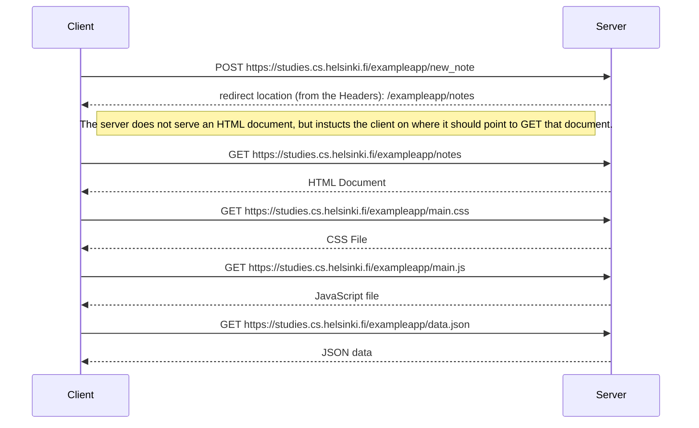
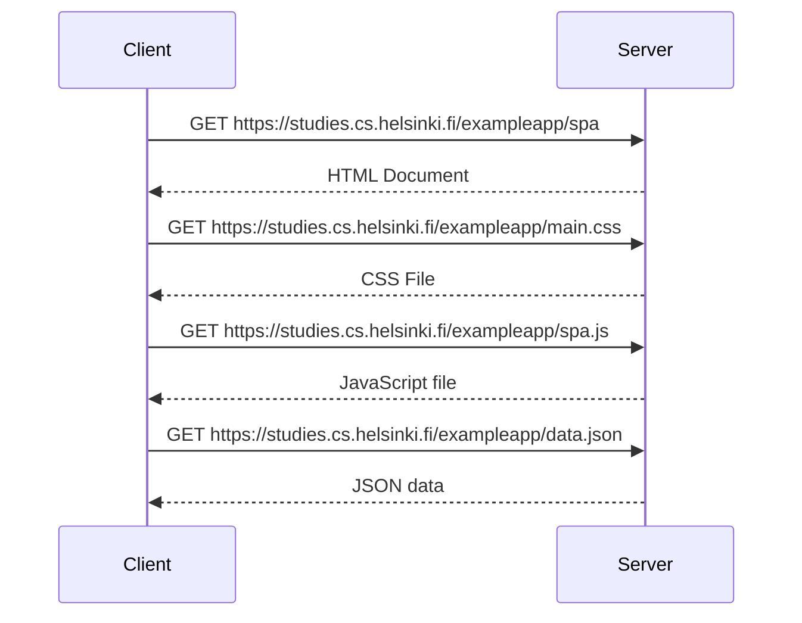
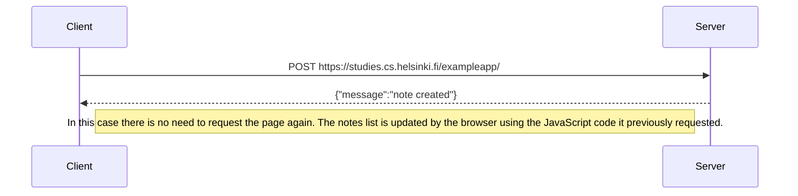

## Exercise 0.4 New note diagram

```mermaid
sequenceDiagram
Client ->> Server: POST https://studies.cs.helsinki.fi/exampleapp/new_note
Server -->> Client: redirect location (from the Headers): /exampleapp/notes

Note right of Client: The server does not serve an HTML document, but instucts the client on where it should point to GET that document.

Client ->> Server: GET https://studies.cs.helsinki.fi/exampleapp/notes
Server -->> Client: HTML Document

Client ->> Server: GET https://studies.cs.helsinki.fi/exampleapp/main.css
Server -->> Client: CSS File

Client ->> Server: GET https://studies.cs.helsinki.fi/exampleapp/main.js
Server -->> Client: JavaScript file

Client ->> Server: GET https://studies.cs.helsinki.fi/exampleapp/data.json
Server -->> Client: JSON data
```

## Exercise 0.5 Single page app diagram

```mermaid
sequenceDiagram
Client ->> Server: GET https://studies.cs.helsinki.fi/exampleapp/spa
Server -->> Client: HTML Document

Client ->> Server: GET https://studies.cs.helsinki.fi/exampleapp/main.css
Server -->> Client: CSS File

Client ->> Server: GET https://studies.cs.helsinki.fi/exampleapp/spa.js
Server -->> Client: JavaScript file

Client ->> Server: GET https://studies.cs.helsinki.fi/exampleapp/data.json
Server -->> Client: JSON data
```

## Exercise 0.6 New note in Single page app diagram

```mermaid
sequenceDiagram
Client ->> Server: POST https://studies.cs.helsinki.fi/exampleapp/
Server -->> Client: {"message":"note created"}

Note right of Client: In this case there is no need to request the page again. The notes list is updated by the browser using the JavaScript code it previously requested.
```

